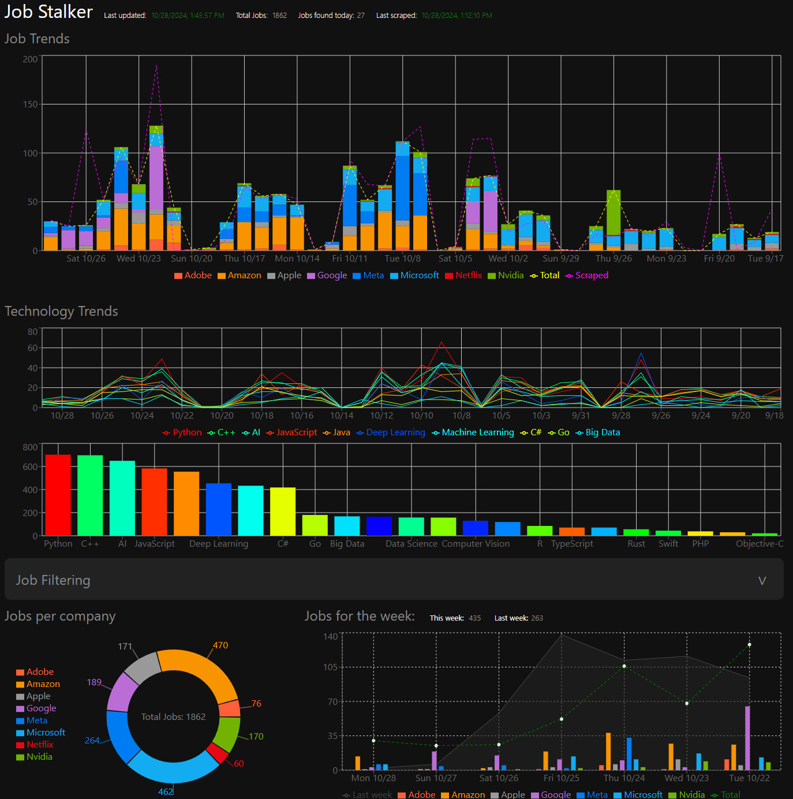
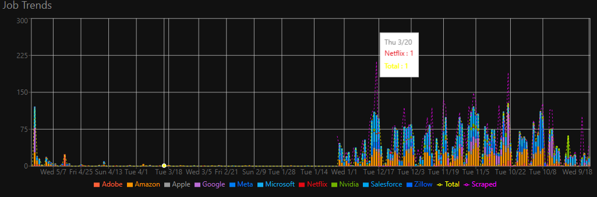
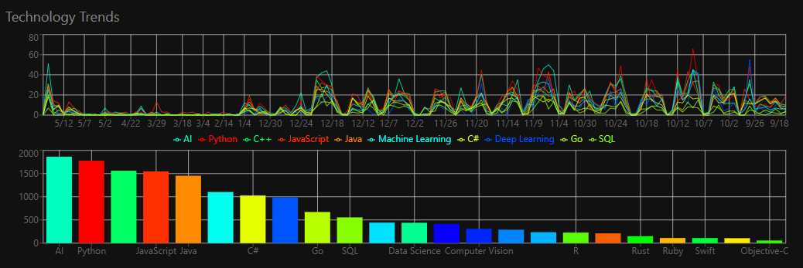
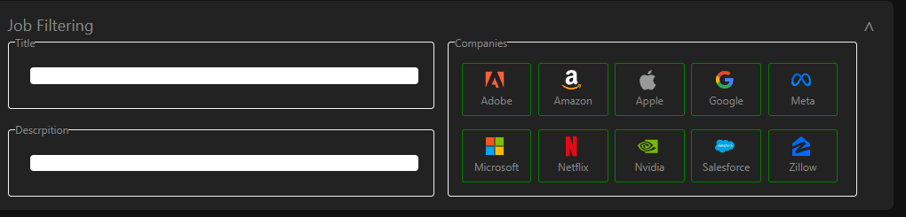
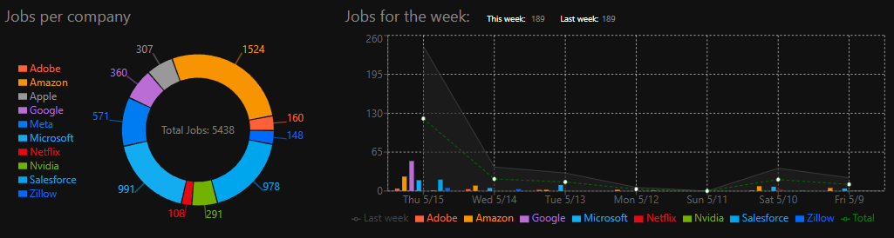
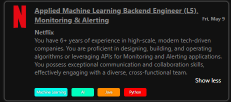

# Job Stalker
Project for monitoring and searching through job listings, parsing job listings, agregating job information such as technology requirements.



## Features

### Job Trends
A graph showing a daily breakdown of jobs posted.


### Tech Trends
A graph showing top level technologies posted for each day and an overall bar chart showing how often a paticular technology is referenced in job postings.


### Search and Filtering
Tools to search through job postings. Fields for searching title, description or filter by any number of companies. Search fields include exclusion of keywords when prefixed with the exclamation mark(`!`).
```
manager !program
```


### Company Share and Weekly Overview
A pie chart shows the percentages of jobs for the filtered search or all jobs if none. The weekly job postings will reflect the search results as well.


### Job Results List
A list of the filtered job listings or all if no search filters.


Each job card gives info:
- Job title
- Link to job post
- Date posted
- Pay range
- Summarization of the job description
- Tags of technical requirements



### Job listing scrapers
The app will scrape job sites every 2 hours.

## Setup

### Prerequisites
You will need a couple things installed before you start.

- Python: https://www.python.org/downloads/
- Node: https://nodejs.org/en/download

### Download
You will need to either download files or git clone the repository to your computer.

Download the Bart Large CNN model from Huggingface: https://huggingface.co/facebook/bart-large-cnn/tree/main
You will need the following files:
- config.json
- merges.txt
- model.safetensors
- vocab.json

In the /backend/ai/models directory, create a folder named `bart-large-cnn` and place the downloaded files.

### Initialize Application
To automatically setup the project, run the `setup.bat` file. This will install packages, initialize a database and kick off services. Content will not show up untill the scrapers have finished getting content. You will not need to use start.bat on setup, it will be ran automatically as a part of the setup process.

### Application start
If you close the services or reboot your computer and want to start the app again, you can run the `start.bat` file.
